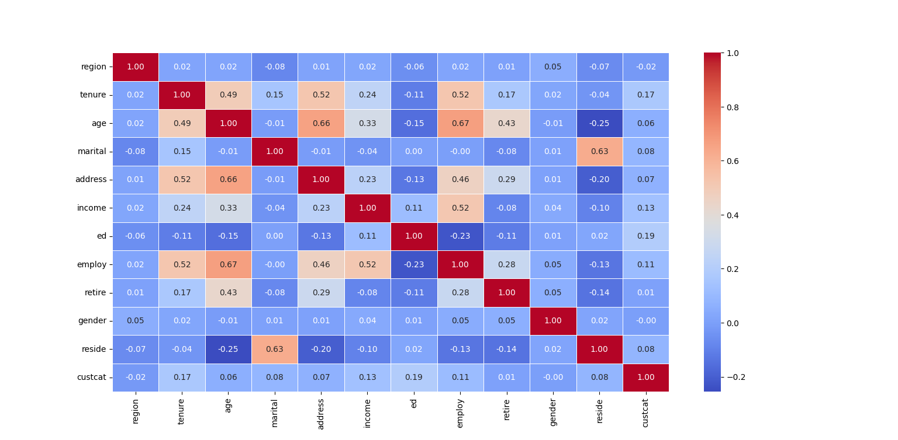
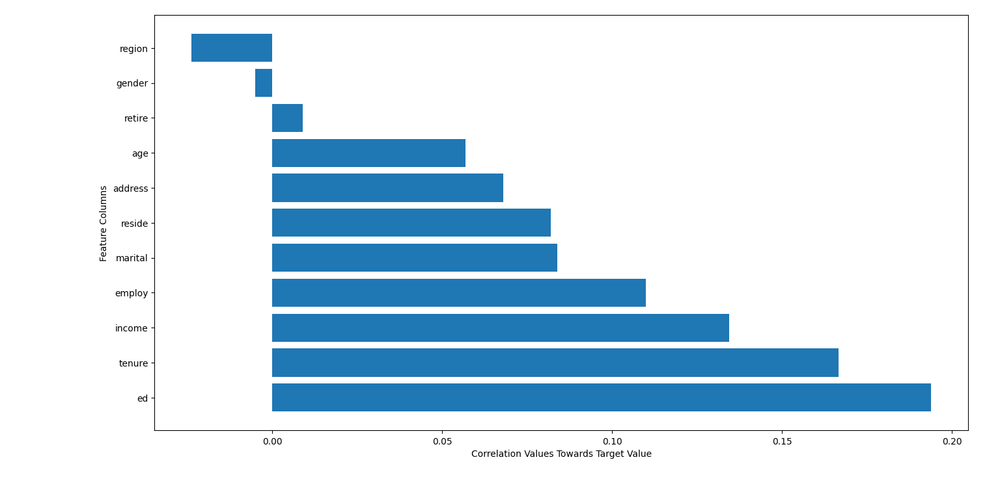
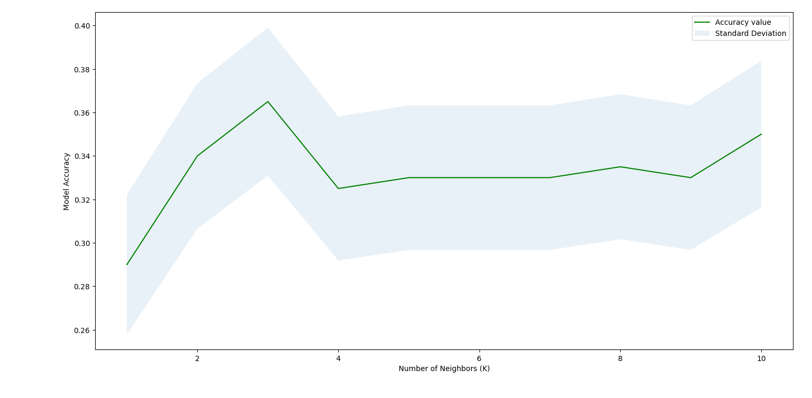

# 👥 Customer Service Category Prediction using K-Nearest Neighbors (KNN)

Predicting customer service subscription categories using the **K-Nearest Neighbors (KNN)** classification algorithm implemented with **Scikit-Learn**.

---

# 📌 Project Overview

This project applies the **K-Nearest Neighbors (KNN)** algorithm to classify customers into one of four service subscription categories using demographic and customer-related information.

The project demonstrates an end-to-end machine learning workflow, including:

* 📊 Exploratory Data Analysis (EDA)
* ⚙️ Data Preprocessing
* 📏 Feature Standardization
* 🤖 Model Training
* 📈 Hyperparameter Tuning
* 📊 Model Evaluation

---

# 📂 Repository Structure

```text
K-Nearest Neighbours
│
├── images/
│   ├── Heatmap_KNN.png
│   ├── BarH_KNN.png
│   └── Plot_Accuracy_KNN.png
│
│
├── Predict Service Category (KNN).py
├── KNN-lab-v1.ipynb
└── README.md
```

---

# 📊 Dataset

**Dataset:** teleCust1000t.csv

The dataset contains customer demographic and service-related information including:

* Region
* Age
* Marital Status
* Address
* Income
* Education
* Employment
* Retirement Status
* Gender
* Residence

### 🎯 Target Variable

```text
custcat
```

Customer service category:

* Category 1 — Basic Service
* Category 2 — E-Service
* Category 3 — Plus Service
* Category 4 — Total Service

The dataset is perfectly balanced, containing **266 observations** for each class. This helps prevent the KNN classifier from favoring one customer category over another due to class imbalance.

---

# 🔄 Machine Learning Workflow

The workflow followed throughout this project:

```text
Dataset
   │
   ▼
Exploratory Data Analysis
   │
   ▼
Data Preprocessing
   │
   ▼
Feature Standardization
(StandardScaler)
   │
   ▼
Train-Test Split
   │
   ▼
K-Nearest Neighbors
   │
   ▼
Hyperparameter Tuning
(k = 1 → 10)
   │
   ▼
Model Evaluation
```

---

# 🔍 Exploratory Data Analysis (EDA)

## Correlation Matrix

<p align="center">
    
</p>

The correlation matrix visualizes the Pearson correlation coefficients between numerical features.

### Observations

* Most feature pairs exhibit weak to moderate correlations.
* Age and employment show moderate positive correlation.
* Education has the strongest positive correlation with the target variable, although the relationship remains relatively weak.
* No severe multicollinearity is present.

---

## Feature Correlation with Target

<p align="center">
    
</p>

This visualization ranks each feature according to its correlation with the customer service category.

Education, tenure, income and employment display the strongest positive relationships with the target variable, whereas region exhibits a slight negative correlation.

Overall, the relatively small correlation values indicate that no individual feature strongly predicts the target class.

---

# ⚙️ Data Preprocessing

Before training the classifier:

* Missing values were checked.
* Duplicate observations were verified.
* Input and target variables were separated.
* All numerical features were standardized using **StandardScaler**.

Feature standardization is essential because KNN relies on **Euclidean distance** when identifying the nearest neighbors. Scaling each feature to have zero mean and unit variance ensures that variables measured on larger numerical scales do not dominate the distance calculations.

---

# 🤖 K-Nearest Neighbors (KNN)

KNN is a supervised, non-parametric, instance-based learning algorithm.

Instead of learning a mathematical model during training, KNN stores the training observations. During prediction, the algorithm identifies the **k nearest neighbors** of a new sample and assigns the majority class among those neighbors.

The initial model was trained using:

```python
KNeighborsClassifier(n_neighbors=3)
```

---

# 📈 Hyperparameter Tuning

## Selecting the Optimal Number of Neighbors

<p align="center">
    
</p>

To determine the optimal value of **k**, multiple KNN classifiers were trained using:

```text
k = 1 → 10
```

For each model:

* Classification accuracy was calculated.
* The standard error of the accuracy estimate was computed.
* Results were visualized using an Accuracy vs. Number of Neighbors graph.

The green curve represents the measured classification accuracy, while the shaded blue region represents the **standard error**, illustrating the uncertainty associated with each measured accuracy.

The highest classification accuracy was achieved when:

```text
k = 3
Accuracy ≈ 36.5%
```

---

# 📊 Model Evaluation

### Evaluation Metric

* Accuracy Score

### Best Performance

| Metric    | Value       |
| --------- | ----------- |
| Optimal k | **3**       |
| Accuracy  | **≈ 36.5%** |

Although **k = 3** produced the highest prediction accuracy, the overall classification performance remained relatively low.

---

# ⚠️ Dataset Limitations

Despite the perfectly balanced dataset, the classifier achieved only modest predictive performance.

Possible reasons include:

* Weak correlation between the available features and the target variable.
* Significant overlap between customer categories.
* Missing behavioral information such as purchasing habits, service usage history, customer preferences, and marketing interactions.

Consequently, customers belonging to different service categories often appear similar in feature space, making accurate classification difficult for a distance-based algorithm such as KNN.

---

# 💡 Key Concepts Demonstrated

* Supervised Learning
* Multi-Class Classification
* K-Nearest Neighbors (KNN)
* Euclidean Distance
* Feature Scaling
* Standardization
* Hyperparameter Tuning
* Model Evaluation
* Exploratory Data Analysis (EDA)

---

# 🛠️ Technologies Used

* Python
* NumPy
* Pandas
* Matplotlib
* Seaborn
* Scikit-Learn
* Jupyter Notebook

---

# 📚 What I Learned

Through this project I learned:

* How KNN performs classification using nearest-neighbor distance calculations.
* Why feature scaling is essential for distance-based machine learning algorithms.
* How different values of **k** influence model complexity and predictive performance.
* How hyperparameter tuning can improve classification accuracy.
* How to interpret feature correlation and exploratory data analysis.
* How dataset characteristics directly influence machine learning performance.

---

# 🚀 Future Improvements

Potential improvements include:

* Cross-Validation for selecting the optimal **k**
* Weighted KNN (`weights='distance'`)
* Alternative distance metrics (Manhattan and Minkowski)
* Principal Component Analysis (PCA)
* Feature Engineering
* Comparison with Logistic Regression, Decision Trees, Random Forests, and Support Vector Machines

---

# 📖 Conclusion

This project demonstrates the implementation of the **K-Nearest Neighbors (KNN)** algorithm for multi-class classification, covering the complete machine learning pipeline from exploratory data analysis to hyperparameter tuning and model evaluation.

Although the final model achieved modest predictive performance, the project highlights the importance of feature quality, appropriate preprocessing, and systematic model evaluation when building machine learning solutions.
